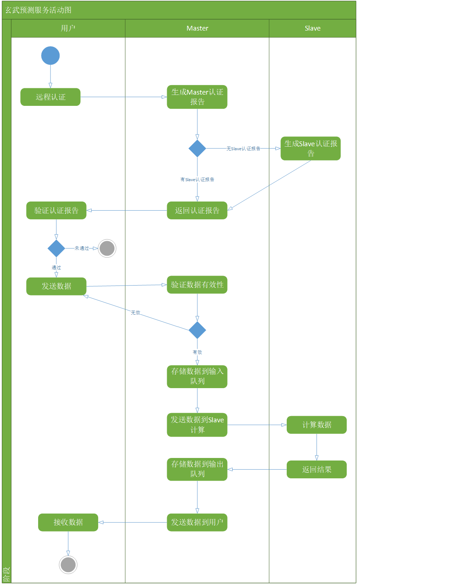

# cluster-inference
For safety concern, we have to build a reliable communication architecture to ensure that the service is correctly initialized in the cloud and not modified and the secure point-to-point channel is built between user and Secure MLaaS. The architecture of communication is proposed as follows:

## Port distribution
| Name        | ip    |  port(communication\|attestation)  |
| --------   | -----:   | :----: |
| Slave        |    IP   |   22100---, 32100---    |
| scheduler        |   IP    |   22000, 32000   |
| Overlay        |   IP    |   21000---, 31000---    |

## Command
(cd scheduler;cargo build --target x86_64-fortanix-unknown-sgx --example scheduler)
ftxsgx-elf2sgxs /home/lww/project/02_Project/01-rust/cluster-inference/scheduler/target/x86_64-fortanix-unknown-sgx/debug/examples/scheduler --heap-size 0x8000000 --stack-size 0x200000 --threads 20 --debug --output /home/lww/project/02_Project/01-rust/cluster-inference/scheduler/target/x86_64-fortanix-unknown-sgx/debug/examples/scheduler.sgxs;sgxs-sign --key ra-enclave/examples/data/vendor-keys/private_key.pem /home/lww/project/02_Project/01-rust/cluster-inference/scheduler/target/x86_64-fortanix-unknown-sgx/debug/examples/scheduler.sgxs /home/lww/project/02_Project/01-rust/cluster-inference/scheduler/target/x86_64-fortanix-unknown-sgx/debug/examples/scheduler.sig -d --xfrm 7/0 --isvprodid 0 --isvsvn 0
ftxsgx-runner --signature coresident /home/lww/project/02_Project/01-rust/cluster-inference/scheduler/target/x86_64-fortanix-unknown-sgx/debug/examples/scheduler.sgxs 

cargo run --target x86_64-unknown-linux-gnu --features verbose --example attest_client -- -e 127.0.0.1:7710 -s 127.0.0.1:1234 -n 0
cargo run --target x86_64-unknown-linux-gnu --features verbose --example attest_client -- -e 127.0.0.1:7719 -s 127.0.0.1:1234 -n 255

cargo run --target x86_64-unknown-linux-gnu --example tvm_user --features verbose -- -e 127.0.0.1:32100 -n 3

ftxsgx-runner --signature coresident /home/lww/project/02_Project/01-rust/cluster-inference/sgx-task-enclave/target/x86_64-fortanix-unknown-sgx/debug/sgx-task-enclave.sgxs

cargo run --target x86_64-unknown-linux-gnu --example service_provider 